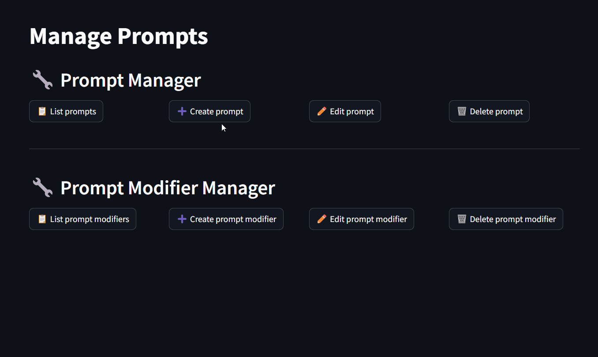

# AnkiFlashcards

Automatic generation of Anki flashcards using Groq’s API based on a word input and customizable prompts, deisgned to assist language learning.

## Features
- Generate Anki flashcards using Groq’s API
- Customize prompts and its modifiers
- User interface with Streamlit
- Export cards in .apkg format compatible with Anki
- SQLite database for prompt and prompt modifiers persistence
- Automated testing with Pytest

## Preview
### Generating the cards

*Enter the words, select a prompt and its modifiers to generate the cards*
### Creating a prompt

*Create the prompts and prompt modifiers. They can also be listed, edited and deleted*
## Getting started

### 1. Clone the repo
```
git clone https://github.com/GustavoKirschnick/AutoAnki.git
cd AutoAnki
```

### 2. Install the dependencies
Make sure that you have [Poetry](https://python-poetry.org/docs/#installing-with-pipx) dependence mannager installed.
```
poetry install
```

### 3. Generate a Groq API key
For the application to run, it is necessary to generate a Groq API key, in the following website:
https://console.groq.com/keys

The key needs to be saved in the `.env` file at the root of the repository, under the name `GROQ_API_KEY`.
```
GROQ_API_KEY = your_key_value
```

### 4. Initialize the database (for the first time **only**)
```
poetry shell
task init_db
```
> **Note**: to use the `task`command, the poetry environmet must be activated prior to it (`poetry shell`).
### 5. Run the FastAPI server
```
task run
```
### 6. Run the interface
```
task run_ui
```

## Components
### Prompts: 
Customizable template that is sent to the API to generate the cards. An example prompt can be seen below: 
```text
Generate flashcards for the words below.
- Use the word in a sentence 
- Send the answer with the following format: 'fornt' and 'back'
- Front: only the example sentence with the word in German. Limit the example sentence for a maximal of 50 words
- Back: only the English translation.
```
**Note 1**: It is important to higlight that the prompt should contain the field `'Front'` and `'Back'`, so the code can parse the answer returned.  
**Note 2**: Only one prompt can be used.

### Prompt Modifiers: 
Similar to the prompts, defines an optional parameter that is combined with the Prompt (e.g tense, style or difficulty). Multiple prompt modifiers can be used at the same time. An exemple can be seen bellow:
```
Using the Konjuntiv 2 form
```
**Note**: Different from the `Prompts`, there is no need to include the fields `'Front'` or `'Back'`.

### Cards: 
The final result outputed by the code, which will be exported to Anki. It has a `'Front'` and `'Back'` field, with their respective content.


## Tech Stack

- **Python 3.12**, or superior version
- **FastAPI** - API back-end
- **Streamlit** - Front-end interface
- **SQLite** - Relational database
- **Pydantic** - Schema validation
- **Pytest** - automatic tetsing
- **genanki** - generate .apkg files
- **Poetry** - Dependency manager

### Running tests
---
Automated tests were implementet with `pydantic` for all endpoints.

To run all the tests:
```
task test
```
It is possible to run tests files separatelly:
```
pytest tests/test_routes_prompt_modifiers.py 
```
Or to run a specific test by name:
```
pytest -k test_create_prompt_modifier_valid
```
> This command runs only the `test_create_prompt_modifier_valid` function.

### Tasks
---
Refer to the `pyproject.toml` file for more
### API Docs
---
Once the FastAPI server is running, the API documentation can be acessed at:  
**Swagger UI**: http://localhost:8000/docs


### To-do
---
- Integration with AnkiConnect to directly send the cards to the Anki app
- Enable the user to edit the generated cards before exporting them
- Enable the user to attribute different tags for different cards in the same deck
- Implement a fixture for the card router, to improve scalability
---


